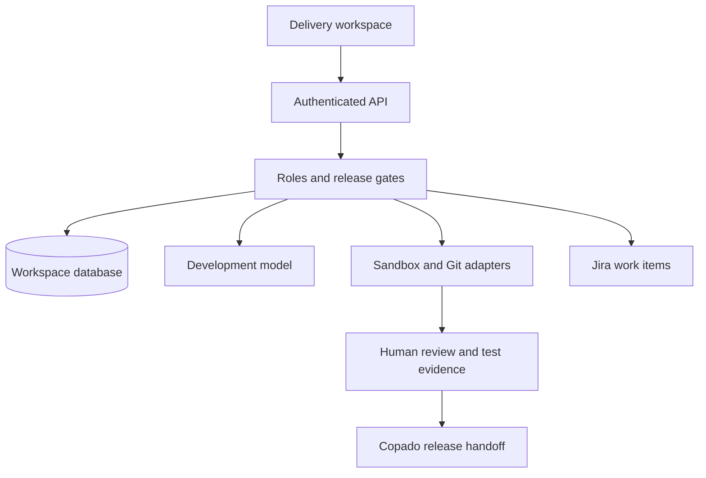

# Architecture and enforcement

The browser presents the workspace and invokes a single server API. It never receives integration secrets, the database service key, Salesforce tokens, or model keys. The Node backend authenticates the encrypted session through Supabase Auth, verifies workspace membership and role, loads encrypted workspace settings, validates a requested action, and calls a purpose-specific adapter.

## Release transitions

| Current state | Allowed next action | Required evidence |
| --- | --- | --- |
| Intake | Analyze | Configured model and verified sandbox identity |
| Clarification | Answer and reanalyze | Model resolves blocking questions; answers do not silently bypass them |
| Plan review | Approve plan | Reviewer role, no blocking questions, complete requirement/story mapping |
| Approved | Create Jira work, generate code | Current plan hash approval |
| Code review | Edit, approve code, commit, validate | Allowlisted metadata, exact artifact approval for commit/validation |
| Validating | Poll Salesforce | Persisted deployment ID, same target org |
| Validated | Approve and deploy sandbox | Successful recent validation, code/release approvals, current account version, Git artifact match, Jira links |
| Deploying | Poll Salesforce | Persisted deployment ID, same target org |
| Sandbox deployed | Run and record acceptance | Reviewer evidence for every acceptance scenario |
| Sandbox complete | Download handoff | Release manifest and metadata for existing Copado process |

Validation/deployment failures return to code review. Code edits invalidate release approvals and validation. Advancing an isolated Git branch requires its head to match the recorded commit; the app never force-pushes. Changed account settings invalidate existing delivery account bindings, requiring a new delivery.

## Enforced controls

- AES-256-GCM authenticated encryption with workspace/type associated data prevents credential reuse across tenants.
- Encrypted HttpOnly cookies use SameSite=Lax and Secure when hosted on HTTPS. Access tokens are refreshed through Supabase Auth and verified server-side.
- POST requests must have the exact configured Origin. OAuth callbacks are GET requests protected by short-lived, account-bound, one-use database state and S256 PKCE.
- The backend uses an explicit host allowlist and disables automatic redirects on outbound requests. Arbitrary internal URLs are not accepted.
- Model outputs cannot call tools. The model returns structured data; the application validates it before exposing actions.
- Generated paths and metadata types are allowlisted. The server builds the manifest. No shell execution, scripts, destructive manifests, or arbitrary file writes occur.
- Salesforce `IsSandbox` and reviewed org ID are checked before validation/deployment. The production route always denies promotion.
- Roles are enforced on every read/write path. Owners configure accounts and may review during the pilot; reviewers approve and accept; developers build; viewers inspect.
- Optimistic concurrency locks prevent two requests from operating on the same delivery simultaneously. A ten-minute lease prevents premature recovery. Durable before/after write checkpoints distinguish recorded results from unknown outcomes. A reconciliation note cannot bypass an unknown outcome.
- External writes are not automatically retried. Jira issue labels support recovery, but do not guarantee exactly-once semantics across Jira indexing delays.
- A durable database record stores deployment IDs. Polling is explicit; no job relies on keeping a browser or serverless request alive.
- Job completion and its audit event commit in one database transaction. Connection replacement and its version increment also commit together, serialized against job acquisition.
- Sandbox approval expires after four hours and binds the validation ID and timestamp, artifact hash, Git commit, account version, and org ID. The branch head is read again before deployment. An external actor can still change Git after that read; the deployed bytes remain the approved package and no merge is performed.
- Audit events record actor, action, job, and artifact hash. Owners cannot mutate audit rows through the app. Database administrators can, so this is **not** immutable regulatory audit storage.
- Login attempts and model requests have database-backed limits. Provider-side quotas remain necessary for cost control.

## Deliberate limitations

There is no browser-password storage, production credential path, generic URL executor, model-controlled permission change, or arbitrary process runner. Sandbox metadata may still contain security-sensitive behavior; a human must review the generated code and permissions. Prompt instructions alone cannot prove generated code is secure.

The org inspection is bounded: an object catalog, up to eight relevant object schemas, and up to 200 Apex class names. It does not retrieve a full baseline, resolve all dependencies, or analyze existing automation. A full source/metadata retrieval service and independent static-analysis runner are future milestones.

The initial release runs every development action through an explicit user request. A future autonomous loop must use a durable queue/worker, bounded retries, scoped execution environments, and the same server gates. It must never interpret a BRD or model response as permission to deploy or expand access.
