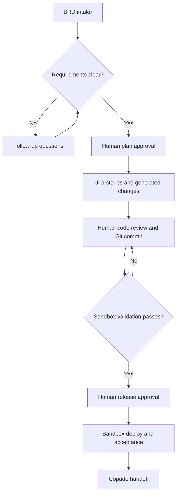

<div align="center">


# Delivery Studio

### Your BRD. Your tools. A reviewed Salesforce release.

Turn business requirements into Jira stories, Salesforce changes, and sandbox test evidence—with human review at every release gate.


[](LICENSE)

**[Try it locally](#try-it-locally) · [Deploy to Vercel](#deploy-to-vercel) · [Connect your accounts](#connect-your-accounts) · [Documentation](#documentation)**

</div>

> [!IMPORTANT]
> **Sandbox pilot:** production deployment is disabled. Copado uses a manual handoff. Live integrations must be verified with your accounts before team use.

## From requirement to release

| 📝 Understand | 🛠️ Build | ✅ Review & release |
| :--- | :--- | :--- |
| Start with a BRD and answer follow-up questions. | Create Jira stories and generate Salesforce metadata with your chosen LLM. | Review changes, validate in a sandbox, record acceptance evidence, and export the Copado handoff. |

Every workspace uses **its own Salesforce org, Jira project, GitHub repository, Copado pipeline details, and model**. No company accounts are hardcoded.

<details>
<summary><strong>See the delivery workflow</strong></summary>


**Workflow:** each action is requested by a user; this pilot does not run an autonomous development loop.



</details>

## Try it locally

**You need:** Node.js 22 and a copy of this repository.

1. Download and extract the repository, or clone it with Git.
2. Open a terminal in the folder containing `package.json`.
3. Run:

```bash
npm run dev
```

4. Open **http://localhost:3000** and select **Open sample workspace**.

**No API keys or package installation are needed for the sample.** It previews the interface without creating tickets, making model calls, or deploying changes.

## Deploy to Vercel

**Start with the sample; connect live accounts afterward.**

1. In Vercel, choose **Add New → Project**.
2. Import **`kamikaze1120/salesforce-delivery-agent`** from GitHub.
3. Use these settings, then select **Deploy**:

| Setting | Value |
| :--- | :--- |
| Framework preset | **Other** |
| Root directory | **`./`** |
| Build command | **`npm run build`** |
| Output directory | **`public`** |
| Node.js version | **22.x** |

Your first deployment can run the sample without environment variables. To enable real sign-in and development, complete the account setup below.

> [!TIP]
> Keep the repository folders intact. Vercel needs `api/service.mjs`, `public/index.html`, and `scripts/check.mjs` in their original locations.

## Connect your accounts

### 1 · Set up sign-in and storage

Create a Supabase project. In its SQL Editor, run [database/schema.sql](database/schema.sql) **once in a new project**, then create your pilot users in Supabase Auth and confirm their emails.

**Upgrading an existing v0.1 database?** Use [the upgrade guide](docs/UPGRADE.md) instead of rerunning the full schema.

### 2 · Add server settings

In your Vercel project's **Settings → Environment Variables**, add the five required values below. Then **redeploy**.

| Variable | What to enter |
| :--- | :--- |
| `APP_ORIGIN` | Your exact HTTPS app address, with no trailing slash |
| `SUPABASE_URL` | Your Supabase project URL |
| `SUPABASE_ANON_KEY` | Your Supabase anon key |
| `SUPABASE_SERVICE_ROLE_KEY` | Your server-only Supabase service-role key |
| `ENCRYPTION_KEY` | A random 32-byte key encoded as base64 |

<details>
<summary><strong>Generate the encryption key / configure local development</strong></summary>

Generate the key in your local terminal:

```bash
node -e "console.log(require('crypto').randomBytes(32).toString('base64'))"
```

Keep a secure backup. The app uses this key to encrypt saved credentials; replacing it without migrating data makes those credentials unreadable.

For local use, copy [.env.example](.env.example) to `.env.local`, fill in the values, and set `APP_ORIGIN=http://localhost:3000`.

Never commit real keys or `.env.local`. Keep signup disabled unless you intentionally enable it. See [the full setup guide](docs/SETUP.md) for optional settings.

</details>

### 3 · Configure your workspace

Sign in, create a workspace, and open **Connections**.

| Connection | What you provide |
| :--- | :--- |
| **Salesforce** | Sandbox URL, OAuth client ID and secret; then authorize the org |
| **Jira Cloud** | Site URL, project key, issue type ID, account email, and API token |
| **GitHub** | The Salesforce repository Copado uses, base branch, metadata directory, and token |
| **Copado** | Pipeline type/name, dev and UAT environments, and release owner for manual handoff |
| **Development LLM** | Your OpenAI or Azure OpenAI model/deployment and API credentials |

The Salesforce repository is separate from the repository hosting this web app. For Salesforce OAuth, use this callback with your actual app address:

```text
https://YOUR-APP-ADDRESS/api/service?op=sfCallback
```

📘 **Need help finding credentials or setting permissions?** Follow [the connection setup guide](docs/SETUP.md#3-configure-a-workspace).

### 4 · Deliver your first small change

1. Add a BRD as pasted text, `.txt`, or `.md`.
2. Analyze it, answer blocking questions, and approve the plan.
3. Create Jira stories, generate changes, and review the files.
4. Approve the code, commit it, and validate in the sandbox.
5. Approve the sandbox release, deploy, and record acceptance evidence.
6. Download the Copado handoff for your existing release process.

**Refresh Salesforce status** after validation or deployment to retrieve the actual outcome.

## Built-in review controls

- **Workspace roles:** owners configure accounts; developers build; reviewers approve; viewers inspect.
- **Exact release approval:** sandbox approval binds the artifact, validation run, Git commit, account version, and target org. It expires after four hours.
- **Safe recovery:** interrupted writes with unknown outcomes stay blocked until investigated.
- **Traceability:** requirements, Jira links, generated files, reviews, and test evidence stay with the delivery.

<details>
<summary><strong>What this pilot does and what comes next?!</strong></summary>

**Available:** BRD clarification, reviewed Jira story creation, allowlisted Apex / CustomObject / Flow / permission-set / LWC generation, isolated Git branches, Salesforce validation, sandbox deployment, and human acceptance evidence.

**Current limits:**

- Copado is a manual handoff; automatic promotion and production deployment are unavailable.
- BRDs must be text or Markdown. PDF and Word extraction are not included.
- Org inspection is bounded; it is not a full source retrieval or dependency analysis.
- Generated code needs human review. Apex validation is not a substitute for business acceptance or LWC/UI testing.
- Jira projects requiring custom fields need additional mappings. Supported models must work with Chat Completions JSON mode.
- The pilot owner may approve their own work; strict separation of duties is not enforced.
- Connection changes require a new delivery. Password recovery is managed through Supabase.

Future work includes an edition-specific Copado adapter, richer document intake, broader test runners, enterprise identity, and production release governance. These are roadmap items, not enabled features.

</details>

## Documentation

| I want to… | Open this |
| :--- | :--- |
| Configure accounts or deploy | [Setup guide](docs/SETUP.md) |
| Understand the controls | [Architecture](docs/ARCHITECTURE.md) |
| See what has been tested | [Verification evidence](docs/VERIFICATION.md) |
| Upgrade an existing installation | [Upgrade guide](docs/UPGRADE.md) |
| Understand the Copado handoff | [Copado connector notes](docs/COPADO-CONNECTOR.md) |
| Contribute a change | [Contributing](CONTRIBUTING.md) |
| Report a security issue | [Security policy](SECURITY.md) |

<details>
<summary><strong>Developer checks</strong></summary>

From the repository root:

```bash
npm test
npm run build
```

The build checks JavaScript syntax. The test suite includes mocked integrations and a local HTTP smoke test; passing checks do not verify your live accounts or generated Salesforce solution.

</details>

---

<div align="center">


[MIT License](LICENSE) · [Code of Conduct](CODE_OF_CONDUCT.md) · [Contributing](CONTRIBUTING.md) · [Security](SECURITY.md)

</div>
