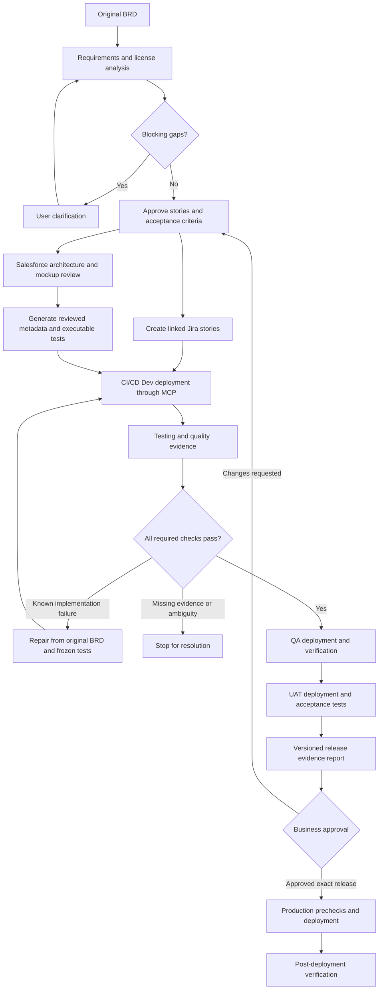

# Delivery architecture and implementation status

This specification supersedes the earlier Sandbox → QA → Dev pipeline. Copado is not part of any new delivery. Vercel hosts the web app; GitHub Actions executes CI/CD; Salesforce hosts the four destination orgs; Supabase persists state, account bindings, evidence and approvals.

## Requirements and Jira

Analysis produces exact-source requirements, user stories, acceptance criteria, blocking questions, risks and acceptance test scenarios together. The planning prompt requires requirement IDs, preconditions, steps and expected results for those scenarios. These initial scenarios are text and have not run. Executable test scripts are generated after implementation, using actual Apex class names and known UI locators. A future structured requirement-time test-case editor remains necessary.

Jira creation uses the configured workspace project and issue type, persists each created issue, and prevents starting CI/CD until every story has an issue. It currently creates one story per action. Ambiguous Jira writes require reconciliation; do not retry blindly. Automatic Jira transitions, comments with release evidence, and bidirectional synchronization are not implemented. The report links Jira issues to requirements and test evidence without posting potentially sensitive reports to Jira automatically.

## Architecture and development

The Architecture tab generates a structured design covering objects, fields, Apex, Flows, validation rules, permission sets, profiles and LWC where appropriate. Each component cites requirements, metadata evidence, license assessment and risk. Security and deployment/recovery design are included. Unresolved questions prevent approval. Approval binds architecture, plan and account configuration; code generation requires it and approved mockups.

Designing a component does not mean its metadata writer exists. Current package validation allows Apex, custom-object XML (including nested fields and validation rules), Draft Flows, permission sets and LWC. Profile XML generation is intentionally not yet supported. Existing standard-object extensions, full metadata retrieval, Flow activation and data migration require further reviewed adapters. Permission-set-first access design remains preferred.

## CI/CD and central orchestration

Fixed order: **Dev → QA → UAT → Production**, with business approval after UAT. Every org must have a distinct verified ID. Dev must match the org used during requirement analysis. Each stage validates the immutable package, deploys, runs tests and returns evidence using GitHub OIDC bound to repository, workflow, reviewed commit, branch, environment and run. Prior-stage success is required. The same artifact moves forward; any implementation repair restarts at Dev with a new artifact hash.

The central layer persists original requirements, decisions, hashes, Jira mapping, tests, failures and bounded repair history. Known non-production failures may be repaired. Tests, permission sets and requirements cannot be weakened by the repair model. Unknown write outcomes, missing quality evidence and exhausted repair budgets stop the run. A repair after QA or UAT still restarts at Dev. Production never self-repairs.

## Quality gate contract

`lib/quality.mjs` requires artifact-bound evidence for coverage, security, performance, license, regression, business and Flow tests. Each category needs a result, source and reason. Missing, failed or unknown evidence blocks promotion. `not_applicable` must be justified by the trusted adapter; it is not an LLM override. The adapter must independently enforce numeric thresholds and applicability. Current schema validation does not prove a tool's output is truthful; its trust boundary is the pinned runner.

`runner/stage.mjs` accepts a JSON evidence file via `DELIVERY_QUALITY_FILE`. This is an integration seam, not a shipped quality-analysis implementation. The current workflow does not configure a producer for that file, so the expanded gate intentionally stops. Install reviewed adapters in the trusted runner, never in model-generated feature code. Adapters must execute before reporting stage success, collect exact artifact/org/test identity, and preserve machine-readable evidence. Never point this at a manually fabricated pass file.

Required adapter work:

| Category | Required evidence | Current implementation |
| --- | --- | --- |
| Apex | Actual class/test results and applicable coverage | Named Apex tests and deployment RunLocalTests exist; coverage adapter pending |
| Flow | Flow-specific scenarios and observable assertions | Dedicated Flow test adapter pending; Draft Flow files alone are not behavioral proof |
| UI | Playwright assertions using dedicated test users | Declarative browser runner exists; selectors and sessions need live verification |
| Regression | Approved baseline and affected-feature results | Dedicated classification/baseline adapter pending |
| Business | Every acceptance criterion linked to observed outcomes | Requirement links exist; complete criterion-level enforcement pending |
| Security | Static analysis, sharing/CRUD/FLS and access tests | Metadata allowlist exists; full security analysis adapter pending |
| Performance | Reviewed thresholds and measured workloads | Performance adapter and org-specific thresholds pending |
| License | Destination-specific edition, assignments, capacities and feature requirements | Development discovery exists; destination requirement-level evaluator pending |

## Business approval and report

Passing UAT creates a report containing requirements, Jira issue links, expected test outcomes and recorded stage results, changed component hashes, risks, license snapshot, commit identity and repair history. The app requires a reviewer to record a rationale. Approval binds the report hash, pipeline ID, artifact, test suite and account configuration. Production refuses a stale or missing approval. GitHub production environment approval remains a second enforced gate; approve the report in the app first. UAT environment review remains an additional pre-deployment control.

The current report is an inspectable JSON view, not yet a polished PDF or dashboard. It does not claim unexecuted work is complete. Tests that did not run remain absent/not run. Production results are recorded separately after release; the approved pre-production report remains a historical snapshot.

## Rollout checklist

1. Complete and verify quality adapters and missing metadata support above.
2. Install the reviewed four-stage runner in the Salesforce source repository and pin its protected commit.
3. Apply migration 003 before use; it also locks account settings while business approval is pending. For installations that already applied an older version, rerun the updated idempotent function migration.
4. Configure four orgs, environment credentials, required reviewers and branch checks.
5. Connect Jira and the model provider; run a small supplied BRD through every non-production layer.
6. Test negative gates, interrupted operations, permissions and license restrictions.
7. Enable production only after end-to-end evidence and explicit release approval.
